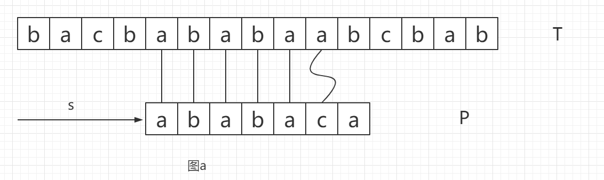
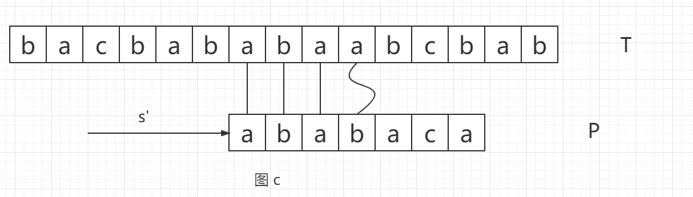

#  
KMP算法笔记

​            概念解释: 使用**ε**表示长度为零的空串，用*xy*表示字符*x*和字符*y*进行顺序拼接，用*w*=*xy*表示字符串w和字符*x*，字符*y*进行顺序拼接的字符串相等。如果*w*=*xy*(*x*,*y*是非空有限的字符串)，则*x*是*w*的前缀，用下方式表示 : *x*ㄈ*w*，同理，*y*就是*w*的后缀，表示为: *y*コ*w*

​         假设有如下图a所示的文本串T和模式串P, 存在着如下的匹配信息，折线表示匹配失败，我们可以利用一些已知的信息，来进行下一次的匹配，对于模式串P我们是已知的，对于和模式串P已经匹配成功一部分的文本串T，我们也可以知晓一部分信息，从而推到出图b和图c

​                        图中的一些说明 : 对于用s' = s+1去匹配T的话，是无效的偏移，由模式串的可以的出第一位a和第二位b是不相等的，对于用s' = s+2去匹配T的话，是有效的偏移，由模式串的可以的出第一位a和第三位a是相等的,a即使aba的前缀也是后缀，那对于已经匹配成功的部分ababa取出来分析，发现存在最长的串aba即使ababa的前缀也是后缀，如图b所示，那我们就可以直接拿P的aba前缀和T的aba的后缀进行重合，让T匹配成功的后一位直接和P的前缀aba的后一位匹配，就可以省略掉一部分的无效的偏移，，图c可以发现有效的偏移量是2 ，正好是串ababa的长度5-她的前缀aba的长度3。 也就是s' = s+(q-π[q])    π[q]是p[q]的最长前缀。取最长前缀是避免出现遗漏,(如:aaaaaaab与aaaaaab情况)。

​       基于上图，可以做出假设p[1 ... q]字符串与T[s+1 ...  s+q] 字符串匹配的话，那么我们可以从这个已经匹配的q个字符串中，找到一个新的最小偏移量，使得p[1 ... q]的前几个字符能与T[s+1 ...  s+q] 的后几个字符匹配，即p[1...k]=T[s'.....s'+k]，因为是T[s+1 ...  s+q] 的后几位，所以得到s'+k =s+q, 求出s'的值也就可以求出有效偏移量了。表达是转换一下 s' = s+(q-k), 求出k也就求出了s'了。

​      求最小偏移量也就是求最长前缀，模式p的前缀函数表达式为:

​        p:{0... m}  → {**ε** ... m-1}

​      p[q]的最大前缀表达式为: 

​          π[q]=max{k | k<q 且 p[k] コ p[q] }      当前缀为**ε**,k为0  。

ps：在求最长前缀式使用 : k = π[k],而不是用k--，因为π[k]中的元素是逐一递增的，也就是相当于和上一个比较,使用while循环和k = π[k]就可以不用担心为负数的问题了。